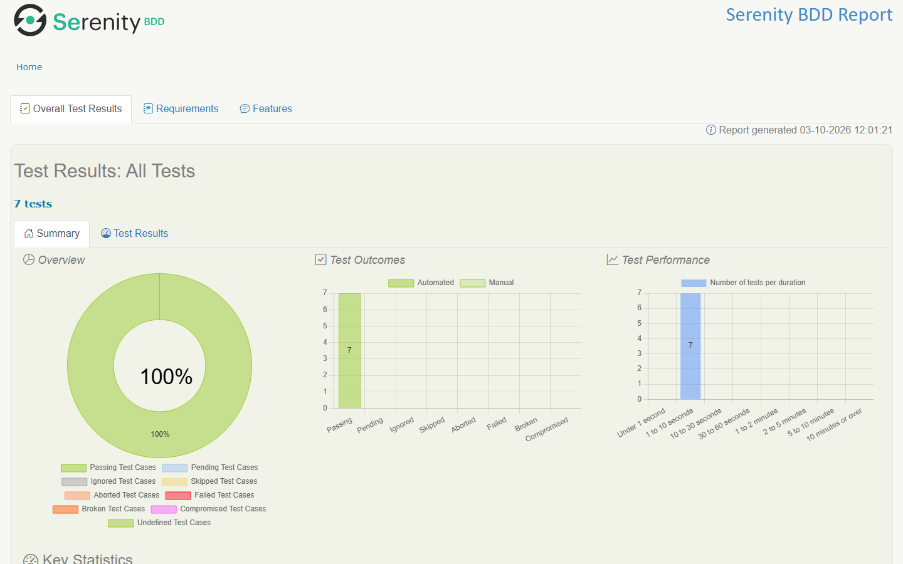

# jQuery UI Datepicker — Serenity BDD Screenplay suite

Data-driven UI automation of a real calendar widget with Serenity BDD, Screenplay and Cucumber, running headless in CI and publishing a living test report on every merge.

[](https://github.com/LeixerM/Serenity_Calendar_Leixer/actions/workflows/gradle.yml)


**Live test report:** https://leixerm.github.io/Serenity_Calendar_Leixer/



## What is tested

System under test: the [jQuery UI datepicker demo](https://jqueryui.com/datepicker/).
Every expected date is computed relative to the day the suite runs, so results are deterministic on any date.

| Scenario | Example | What it proves |
|---|---|---|
| Select a date (Scenario Outline) | today's date | The highlighted "today" cell fills the field correctly |
| | day 15 of the current month | Basic selection, `MM/dd/yyyy` format |
| | day 10 of the next month | Forward navigation |
| | day 20 of the previous month | Backward navigation |
| | last day of the current month | Month edge (28/29/30/31) |
| | 1st of next January | Year boundary (December → January) |
| Typing a date moves the calendar | `02/29/2028` | The widget parses typed input (leap day) and jumps to that month/day |

The date arithmetic itself is covered by fast JUnit 5 unit tests (`CalendarDatesTest`): year boundaries in both directions, leap years and formatting.

## Architecture (Screenplay pattern)

Actors perform **tasks**, made of **interactions**, against **UI targets**, and check the outcome by asking **questions**.

```
src/main/java/datepicker/jqueryui/com
├── tasks/          Business-level goals: NavigateTo, SelectDate, TypeDate
├── interactions/   Reusable low-level actions: MoveCalendar (page N months back/forward)
├── questions/      What the actor can observe: field value, displayed month, highlighted day
├── ui/             Targets (locators) of the datepicker, kept in one place
└── utils/          CalendarDates: resolves "next January" / "last" / "today" into real dates
src/test/java/datepicker/jqueryui/com
├── runners/        JUnit Platform Suite that runs the Cucumber engine with the Serenity reporter
├── stepdefinitions/ Thin glue: maps Gherkin to tasks and Ensure assertions
└── utils/          Unit tests for the date logic
src/test/resources
├── features/       calendar.feature (Gherkin)
└── serenity.conf   Browser, headless mode and environment URLs
```

Design choices:

- **No branching on test data**: one parametrized `SelectDate` task handles every example.
- **No `Thread.sleep`**: Serenity `WaitUntil` waits, plus a day locator that only matches once the expected month is displayed.
- **Readable failures**: assertions use Serenity `Ensure` with named questions, so a failure reports what was checked plus the expected and actual values.

## Run locally

Requirements: JDK 21 and Google Chrome (the driver is resolved automatically by Selenium Manager).

```bash
./gradlew clean test aggregate                          # full suite + HTML report
./gradlew clean test aggregate -Dcucumber.filter.tags="@TypeDate"   # one scenario by tag
```

Open `target/site/serenity/index.html` to see the report. Chrome runs headless (see `serenity.conf`); remove `headless=new` there to watch the browser.

## Continuous integration

[`.github/workflows/gradle.yml`](.github/workflows/gradle.yml):

- Runs on every push to `main`, every pull request and on demand (optionally with a Cucumber tag expression).
- Java 21 (Temurin), Gradle dependency cache, headless Chrome.
- Uploads the Serenity report as a build artifact on every run, pass or fail.
- On pushes to `main`, deploys the report to GitHub Pages, so the live report always reflects the latest `main`.

## Author

Leixer Molina — QA Engineer · [Portfolio](https://leixerm.github.io/) · [LinkedIn](https://www.linkedin.com/in/leixer-molina/)
